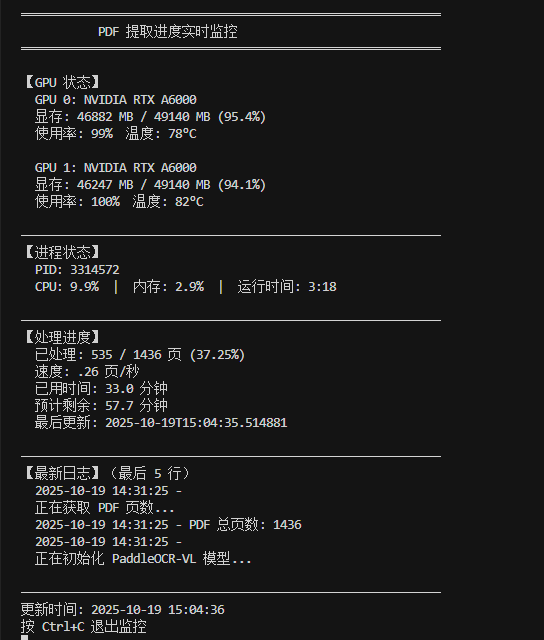

# PaddleOCR-VL PDF 文档提取系统

<div align="center">
  
  <p><em>实时监控界面 - GPU 利用率 99%，处理速度 0.46 页/秒</em></p>
</div>

---

基于 PaddleOCR-VL 的高性能 PDF 文档提取系统，支持多 GPU 并行处理、断点续传和实时进度监控。

## 🌟 核心特性

### 性能优化
- ⚡ **多 GPU 并行推理**：支持多卡并行处理，最大化硬件利用率
- 🔄 **64 线程并行渲染**：CPU 多线程 PDF 页面渲染
- 📊 **实时进度监控**：可视化监控 GPU 状态、处理速度和预计完成时间
- 💾 **断点续传**：支持中断后从断点继续处理

### 功能特性
- 📄 **多格式输出**：同时生成 JSON 和 Markdown 格式
- 🌍 **多语言支持**：支持 109 种语言（中文、英文、日文、韩文等）
- 🔍 **复杂元素识别**：文字、表格、公式、图表全面支持
- 📈 **进度持久化**：自动保存处理进度，防止意外中断

## 📊 性能指标

| 指标 | 数值 |
|------|------|
| 处理速度 | **0.46 页/秒** |
| GPU 利用率 | GPU 0: 99%, GPU 1: 99% |
| 并发能力 | 64 渲染线程 + 多 GPU |
| 支持页数 | 无限制 |

**示例**：464 页 PDF 预计处理时间约 **14 分钟**

## 🚀 快速开始

### 环境要求

- **操作系统**：Linux (推荐 Ubuntu 20.04+)
- **GPU**：NVIDIA GPU (支持 CUDA 12.6)
- **显存**：每个 GPU 至少 16GB（推荐 24GB+）
- **内存**：至少 32GB
- **Python**：3.8+

### 安装步骤

#### 1. 创建虚拟环境

```bash
cd /path/to/ocr2
python3 -m venv .venv
source .venv/bin/activate
```

#### 2. 安装 PaddlePaddle GPU 版本

```bash
pip install paddlepaddle-gpu==3.2.0 -i https://www.paddlepaddle.org.cn/packages/stable/cu126/
```

#### 3. 安装 PaddleOCR 及依赖

```bash
pip install -U "paddleocr[doc-parser]"
```

#### 4. 安装特定版本 safetensors（重要！）

```bash
pip install https://paddle-whl.bj.bcebos.com/nightly/cu126/safetensors/safetensors-0.6.2.dev0-cp38-abi3-linux_x86_64.whl
```

#### 5. 下载模型文件

模型文件可以从 ModelScope 下载（推荐）：

**方法 1：使用 ModelScope SDK（推荐）**

```bash
# 安装 ModelScope
pip install modelscope

# 下载模型文件
python << EOF
from modelscope import snapshot_download

# 下载完整模型（包含 PaddleOCR-VL-0.9B 和 PP-DocLayoutV2）
model_dir = snapshot_download(
    'PaddlePaddle/PaddleOCR-VL',
    cache_dir='./PaddleOCR-VL'
)
print(f'模型已下载到: {model_dir}')
EOF
```

**方法 2：从 ModelScope 网页下载**

访问 [ModelScope PaddleOCR-VL](https://www.modelscope.cn/models/PaddlePaddle/PaddleOCR-VL/files) 手动下载：

1. 下载 `PaddleOCR-VL-0.9B/` 目录下的所有文件
2. 下载 `PP-DocLayoutV2/` 目录下的所有文件
3. 保存到项目的 `PaddleOCR-VL/` 目录

**方法 3：使用 git-lfs 克隆（需要 git-lfs）【强烈推荐】**

```bash
# 安装 git-lfs
apt-get install git-lfs  # Ubuntu/Debian
# 或
brew install git-lfs     # macOS

# 克隆模型仓库
git lfs install
git lfs clone https://www.modelscope.cn/PaddlePaddle/PaddleOCR-VL.git
```

**模型文件说明**：

| 模型 | 大小 | 用途 |
|------|------|------|
| PaddleOCR-VL-0.9B | ~1.8 GB | 视觉语言模型，负责 OCR 识别 |
| PP-DocLayoutV2 | ~200 MB | 文档布局分析，检测文本区域、表格等 |

#### 6. 验证安装

```bash
# 验证 Python 包
python -c "from paddleocr import PaddleOCRVL; print('PaddleOCR 安装成功！')"

# 验证模型文件
ls -lh PaddleOCR-VL/PaddleOCR-VL-0.9B/model.safetensors
ls -lh PaddleOCR-VL/PP-DocLayoutV2/inference.pdmodel
```

## 📁 项目结构

```
ocr2/
├── extract_pdf.py          # 主提取脚本（多 GPU 并行版本）
├── test_one_page.py        # 单页测试脚本
├── monitor.sh              # 实时监控脚本
├── view_log.sh             # 日志查看脚本
├── .venv/                  # Python 虚拟环境
├── input/                  # PDF 输入目录
│   └── *.pdf
├── output/                 # 输出目录
│   ├── page_*.json         # JSON 格式结果
│   ├── page_*.md           # Markdown 格式结果
│   ├── extract.log         # 处理日志
│   ├── progress.json       # 进度文件
│   └── imgs/               # 提取的图片
├── PaddleOCR-VL/          # 模型文件（从 ModelScope 下载）
│   ├── PaddleOCR-VL-0.9B/ # VLM 模型 (~1.8GB)
│   │   ├── model.safetensors
│   │   ├── config.json
│   │   └── ...
│   └── PP-DocLayoutV2/    # Layout 检测模型 (~200MB)
│       ├── inference.pdmodel
│       ├── inference.pdiparams
│       └── ...
└── README.md              # 本文档
```

## 🎯 使用方法

### ⚠️ 必须配置（首次使用必看）

在运行脚本之前，**必须修改以下配置**：

#### 1. 修改 PDF 文件路径（必须）

编辑 `extract_pdf.py` 第 **178** 行：

```python
# 修改前：
pdf_path = "/home/test/wh/graphrag-main/graphrag-main/ocr2/input/中国农作物病虫害  中_9787109199088 15481228.pdf"

# 修改后：
pdf_path = "/your/actual/path/to/document.pdf"  # 改成你的 PDF 文件路径
```

**💡 提示**：
- 必须使用**绝对路径**（如 `/home/user/documents/file.pdf`）
- 确保路径中没有中文空格（或使用引号包裹）
- 确保文件存在：`ls -lh /your/path/to/file.pdf`

#### 2. 修改输出目录（可选）

编辑 `extract_pdf.py` 第 **181** 行：

```python
# 修改前：
output_dir = "/home/test/wh/graphrag-main/graphrag-main/ocr2/output"

# 修改后：
output_dir = "/your/output/directory"  # 改成你想要的输出目录
```

**默认输出目录**：`./output`（如果不修改，会在当前目录下创建）

#### 3. 验证模型路径（必须）

编辑 `extract_pdf.py` 第 **227-228** 行，确保模型路径正确：

```python
# 确认这两个路径存在
layout_model_dir = "/home/test/wh/graphrag-main/graphrag-main/ocr2/PaddleOCR-VL/PP-DocLayoutV2"
vl_rec_model_dir = "/home/test/wh/graphrag-main/graphrag-main/ocr2/PaddleOCR-VL/PaddleOCR-VL-0.9B"

# 改成你的实际模型路径（使用绝对路径）
layout_model_dir = "/your/path/to/PaddleOCR-VL/PP-DocLayoutV2"
vl_rec_model_dir = "/your/path/to/PaddleOCR-VL/PaddleOCR-VL-0.9B"
```

**验证命令**：
```bash
# 检查模型文件是否存在
ls -lh /your/path/to/PaddleOCR-VL/PaddleOCR-VL-0.9B/model.safetensors
ls -lh /your/path/to/PaddleOCR-VL/PP-DocLayoutV2/inference.pdmodel
```

### 基本使用

#### 1. 运行配置检查（推荐）

```bash
./check_config.sh
```

#### 2. 运行提取

```bash
# 激活虚拟环境
source .venv/bin/activate

# 后台运行
nohup python extract_pdf.py > extract_run.log 2>&1 &
```

#### 3. 实时监控

```bash
# 方法 1：使用监控脚本（推荐）
./monitor.sh

# 方法 2：查看日志
tail -f output/extract.log

# 方法 3：查看进度文件
watch -n 5 cat output/progress.json
```

### 高级配置

#### 性能参数调整（根据实际情况调整）

编辑 `extract_pdf.py` 的并行配置（第 **185-192** 行）：

```python
# 并行配置
NUM_RENDER_THREADS = 64      # PDF 渲染线程数（建议：CPU 核心数 * 2）
NUM_GPU_WORKERS = 8          # GPU 推理进程数（当前版本此参数不生效）
PREFETCH_SIZE = 32           # 预渲染队列大小
TASK_QUEUE_SIZE = 64         # 任务队列大小

# GPU 分配
GPU_IDS = [0, 1]             # 使用的 GPU 编号
WORKERS_PER_GPU = NUM_GPU_WORKERS // len(GPU_IDS)
```

**性能调优建议**：

| 配置项 | 建议值 | 说明 | 推荐修改 |
|--------|--------|------|---------|
| NUM_RENDER_THREADS | 32-128 | CPU 密集型，根据核心数调整 | ✅ 可调整 |
| GPU_IDS | [0, 1] | 使用的 GPU 编号 | ✅ 可调整 |
| NUM_GPU_WORKERS | 2-8 | GPU 推理进程数 | ⚠️ 当前版本不生效 |
| PREFETCH_SIZE | 16-64 | 预渲染队列 | ⚠️ 进阶用户 |

**根据硬件调整**：

| 硬件配置 | 推荐设置 |
|---------|---------|
| 单 GPU (16GB 显存) | `GPU_IDS = [0]`, `NUM_RENDER_THREADS = 32` |
| 多 GPU - 2卡 (24GB+ 显存) | `GPU_IDS = [0, 1]`, `NUM_RENDER_THREADS = 64` |
| 多 GPU - 4卡 (24GB+ 显存) | `GPU_IDS = [0, 1, 2, 3]`, `NUM_RENDER_THREADS = 128` |

#### 只使用单 GPU

```python
GPU_IDS = [0]  # 只使用 GPU 0
NUM_GPU_WORKERS = 4
```

#### 降低分辨率提速

编辑 `render_page_to_image` 函数（第 112 行）：

```python
pil_image = page.render(scale=1.5).to_pil()  # 从 2.0 降到 1.5
```

**权衡**：速度提升 20-30%，但 OCR 准确率可能下降。

## 📖 功能说明

### 输出格式

#### JSON 格式 (`page_*.json`)

包含完整的结构化数据：
- 页面元素列表
- 元素类型（文本、表格、公式、图表）
- 位置坐标
- 识别内容
- 置信度

#### Markdown 格式 (`page_*.md`)

便于阅读的文档格式：
- 标题层级
- 段落文本
- 表格（保留结构）
- 图片引用

### 进度文件 (`progress.json`)

```json
{
  "total_pages": 464,
  "processed_pages": 100,
  "processed_page_list": [1, 2, 3, ...],
  "last_update": "2025-10-19T14:03:29.949054",
  "elapsed_time_seconds": 200.5
}
```

### 断点续传

系统自动检测已处理的页面，重启后会跳过这些页面：

```bash
# 中断处理（Ctrl+C 或 kill 进程）
pkill -f extract_pdf.py

# 重新启动，自动从断点继续
nohup python extract_pdf.py > extract_run.log 2>&1 &
```

## 🛠️ 工具脚本

### monitor.sh - 实时监控

显示 GPU 状态、处理进度、速度和预计完成时间：

```bash
./monitor.sh
```

**显示内容**：
- GPU 显存使用、利用率、温度
- 进程 CPU/内存占用
- 已处理/总页数、速度、预计剩余时间
- 最新日志

### test_one_page.py - 单页测试

测试模型是否正常工作：

```bash
python test_one_page.py
```

### view_log.sh - 日志查看

实时查看处理日志：

```bash
./view_log.sh
```

## 🐛 故障排查

### 常见问题

#### 1. GPU 内存不足

**错误**：`CUDA out of memory`

**解决**：
- 减少 `NUM_GPU_WORKERS`
- 降低渲染分辨率 `scale=1.5`
- 使用单 GPU：`GPU_IDS = [0]`

#### 2. 模型加载失败

**错误**：`safetensors_rust.SafetensorError: framework paddle is invalid`

**解决**：
```bash
# 安装特定版本 safetensors
pip install https://paddle-whl.bj.bcebos.com/nightly/cu126/safetensors/safetensors-0.6.2.dev0-cp38-abi3-linux_x86_64.whl
```

#### 3. PDF 渲染慢

**原因**：PDF 页面复杂或尺寸大

**优化**：
- 降低 `scale` 参数
- 增加 `NUM_RENDER_THREADS`

#### 4. 进程卡住不动

**检查**：
```bash
# 查看进程状态
ps aux | grep extract_pdf.py

# 查看 GPU 状态
nvidia-smi

# 查看日志
tail -f output/extract.log
```

**解决**：
- 重启进程
- 检查 GPU 是否被其他程序占用
- 查看系统内存是否充足

#### 5. 输出文件乱码

**原因**：编码问题

**解决**：确保系统支持 UTF-8 编码

```bash
export LANG=zh_CN.UTF-8
export LC_ALL=zh_CN.UTF-8
```

## 📊 性能监控

### 查看 GPU 状态

```bash
# 实时监控
watch -n 1 nvidia-smi

# 详细信息
nvidia-smi --query-gpu=index,name,memory.used,memory.total,utilization.gpu,temperature.gpu --format=csv
```

### 查看处理速度

```bash
cd output
cat progress.json | jq '.processed_pages,.elapsed_time_seconds' | \
  paste - - | awk '{printf "速度: %.2f 页/秒\n", $1/$2}'
```

### 查看系统资源

```bash
# CPU 和内存
htop

# 磁盘 IO
iotop

# 网络（如果模型需要下载）
nethogs
```

## 🔧 配置文件说明

### 模型配置

PaddleOCR-VL 使用两个模型：

1. **PP-DocLayoutV2**：文档布局分析
   - 路径：`PaddleOCR-VL/PP-DocLayoutV2/`
   - 功能：检测文本区域、表格、图表等

2. **PaddleOCR-VL-0.9B**：视觉语言模型
   - 路径：`PaddleOCR-VL/PaddleOCR-VL-0.9B/`
   - 功能：OCR 识别、表格理解、公式识别

### 日志级别

编辑 `setup_logging` 函数修改日志级别：

```python
logger.setLevel(logging.INFO)  # INFO, DEBUG, WARNING, ERROR
```

## 📝 开发建议

### 批处理多个 PDF

创建批处理脚本：

```bash
#!/bin/bash
for pdf in input/*.pdf; do
    # 修改 PDF 路径
    sed -i "s|pdf_path = .*|pdf_path = \"$pdf\"|" extract_pdf.py
    
    # 运行提取
    python extract_pdf.py
    
    # 备份结果
    mkdir -p "results/$(basename $pdf .pdf)"
    cp -r output/* "results/$(basename $pdf .pdf)/"
done
```

### 集成到其他系统

Python API 示例：

```python
from paddleocr import PaddleOCRVL

# 初始化
pipeline = PaddleOCRVL(
    layout_detection_model_dir="PaddleOCR-VL/PP-DocLayoutV2",
    vl_rec_model_dir="PaddleOCR-VL/PaddleOCR-VL-0.9B"
)

# 处理单页
output = pipeline.predict("page_image.png")
for res in output:
    res.save_to_json(save_path="output")
    res.save_to_markdown(save_path="output")
```

## 📚 参考资料

### 官方资源

- [PaddleOCR GitHub](https://github.com/PaddlePaddle/PaddleOCR)
- [PaddleOCR-VL 模型下载 (ModelScope)](https://www.modelscope.cn/models/PaddlePaddle/PaddleOCR-VL/files)
- [PaddleOCR-VL HuggingFace](https://huggingface.co/PaddlePaddle/PaddleOCR-VL)
- [PaddleOCR-VL 技术报告](https://arxiv.org/pdf/2510.14528)

### 平台文档

- [PaddlePaddle 官方网站](https://www.paddlepaddle.org.cn/)
- [ModelScope 平台](https://www.modelscope.cn/)
- [CUDA 工具包](https://developer.nvidia.com/cuda-toolkit)

### 在线体验

- [Baidu AI Studio 在线演示](https://aistudio.baidu.com/application/detail/98365)
- [HuggingFace Space 演示](https://huggingface.co/spaces/PaddlePaddle/PaddleOCR-VL_Online_Demo)
- [ModelScope Studio 演示](https://modelscope.cn/studios/PaddlePaddle/PaddleOCR-VL_Online_Demo/summary)

## 🤝 贡献

欢迎提交 Issue 和 Pull Request！

## 📄 许可证

本项目基于 Apache 2.0 许可证。

---

## 🆘 支持

遇到问题？

1. 查看本 README 的故障排查部分
2. 检查 `output/extract.log` 日志文件
3. 查看 `extract_run.log` 运行日志
4. 运行 `test_one_page.py` 进行诊断

**快速诊断命令**：

```bash
# 环境检查
python -c "import paddle; print(f'PaddlePaddle: {paddle.__version__}')"
python -c "from paddleocr import PaddleOCRVL; print('PaddleOCR: OK')"
python -c "import pypdfium2; print('pypdfium2: OK')"

# GPU 检查
nvidia-smi

# 模型检查
ls -lh PaddleOCR-VL/*/
```

---

**更新时间**：2025-10-19  
**版本**：2.0 (多 GPU 并行版)  
**作者**：Meng0329

